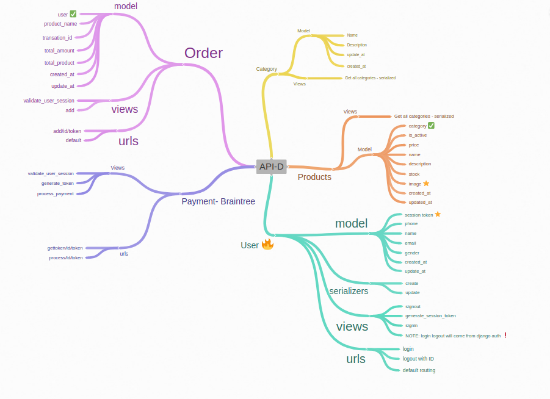

# E-commerce Website

### Introduction

- A project which are based on to building a E-Commerce Website. It is totally a full fledged website with the powerfull backend with intregation of payment gateway.

- I was created a REST API for backend and use them In a frontend. For creating REST API I used a Django-rest-framework and grab whole data into the REST API (As a JSON Format). For grabbing data into JSON format I used Serialization. 

- For the frontend, I used some NodeJS packages for handling REST API in the frontend site.

### Technology
- Python3
- Django
- Django Rest-Framework
- Sqlite3 Database
- React Js

### Design

 - Backend 

 

